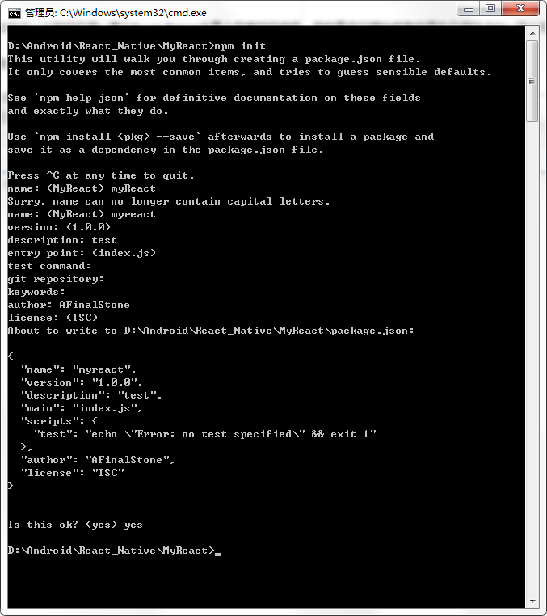
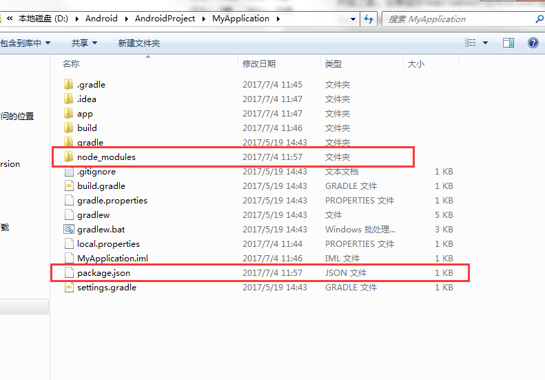
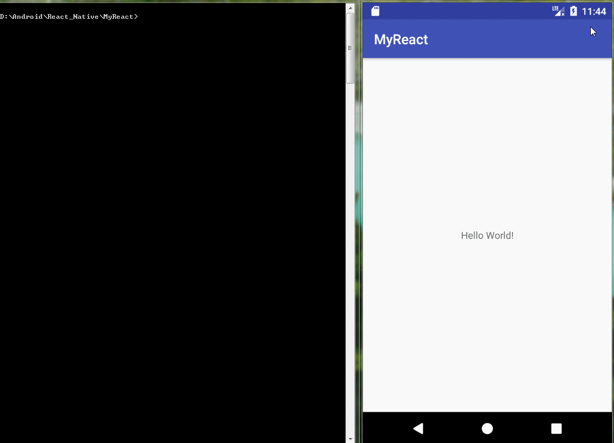

## 核心概念

如果你正准备从头开始制作一个新的应用，那么React Native会是个非常好的选择。但如果你只想给现有的原生应用中添加一两个视图或是业务流程，React Native也同样不在话下。只需简单几步，你就可以给原有应用加上新的基于React Native的特性、画面和视图等。

把React Native组件植入到Android应用中有如下几个主要步骤：

1. 首先当然要了解你要植入的React Native组件。
2. 在Android项目根目录中使用npm来安装`react-native` ，这样同时会创建一个`node_modules/`的目录。
3. 创建js文件，编写React Native组件的js代码。
4. 在`build.gradle`文件中添加`com.facebook.react:react-native:+`，以及一个指向`node_nodules/`目录中的`react-native`预编译库的`maven`路径。
5. 创建一个React Native专属的`Activity`，在其中再创建`ReactRootView`。
6. 启动React Native的Packager服务，运行应用。
7. 根据需要添加更多React Native的组件。
8. 在真机上[运行](running-on-device-android.html)、[调试](debugging.html)。
9. [打包](signed-apk-android.html)。
10. 发布应用，升职加薪，走向人生巅峰！😘


## 开发环境准备

首先按照[开发环境搭建教程](getting-started.html)来安装React Native在安卓平台上所需的一切依赖软件（比如`npm`）。

## 在应用中添加JS代码

在项目的根目录中运行：

```cmd
npm init
npm install --save react react-native
curl -o .flowconfig https://raw.githubusercontent.com/facebook/react-native/master/.flowconfig
```
- 1.npm init`创建了一个空的node模块(过程需要填写其实就是创建了一个package.json描述文件)。



- 2.npm install`则创建了node_modules目录并把react和react-native下载到了其中。



- 3.**这一步非必需，可跳过**，curl命令，其实质是`下载`.flowconfig配置文件，这个文件用于约束js代码的写法。

下面我们打开新创建的`package.json`文件，去除:

```bash
    "test": "echo \"Error: no test specified\" && exit 1"
```

然后在其`scripts`字段中加入:

    "start": "node node_modules/react-native/local-cli/cli.js start"

现在你的`package.json`内容应该类似这样：

```bash
{
  "name": "myreact",
  "version": "1.0.0",
  "description": "test",
  "main": "index.js",
  "private": true,
  "scripts": {
    "start": "node node_modules/react-native/local-cli/cli.js start"

  },
  "author": "AFinalStone",
  "license": "ISC"
}
```

> 示例中的`version`字段没有太大意义（除非你要把你的项目发布到npm仓库）。`scripts`中是用于启动packager服务的命令。`dependencies`中的react和react-native的版本取决于你的具体需求。一般来说我们推荐使用最新版本。你可以使用`npm info react`和`npm info react-native`来查看当前的最新版本。另外，react-native对react的版本有严格要求，高于或低于某个范围都不可以。本文无法在这里列出所有react native和对应的react版本要求，只能提醒读者先尝试执行npm install，然后注意观察安装过程中的报错信息，例如`require react@某.某.某版本, but none was installed`，然后根据这样的提示，执行`npm i -S react@某.某.某版本`。


接下来在项目根目录中创建`index.android.js`文件，然后将下面的代码复制粘贴进来：

```js
'use strict';

import React from 'react';
import {
  AppRegistry,
  StyleSheet,
  Text,
  View
} from 'react-native';

class HelloWorld extends React.Component {
  render() {
    return (
      <View style={styles.container}>
        <Text style={styles.hello}>Hello, World</Text>
      </View>
    )
  }
}
var styles = StyleSheet.create({
  container: {
    flex: 1,
    justifyContent: 'center',
  },
  hello: {
    fontSize: 20,
    textAlign: 'center',
    margin: 10,
  },
});

AppRegistry.registerComponent('myreact', () => HelloWorld);
```

- 注意，AppRegistry.registerComponent('myreact', () => HelloWorld)的第一个参数要和package.json中的name一致

## 准备工作

在你的app中 `build.gradle` 文件中添加 React Native 依赖:

```
 dependencies {
     compile "com.facebook.react:react-native:+" // From node_modules.
 }
```

> 如果想要指定特定的React Native版本，可以用具体的版本号替换 `+`，当然前提是你从npm里下载的是这个版本 。

在项目的 `build.gradle` 文件中为 React Native 添加一个 maven 依赖的入口，必须写在 "allprojects" 代码块中:

```
allprojects {
    repositories {
        jcenter()
        maven { url 'https://maven.google.com' }
        maven {
            // All of React Native (JS, Android binaries) is installed from npm
            url "$rootDir/node_modules/react-native/android"
        }
    }
}
```

> 确保依赖路径的正确！以免在 Android Studio 运行Gradle同步构建时抛出 “Failed to resolve: com.facebook.react:react-native:0.x.x" 异常。

接着，在 `AndroidManifest.xml` 清单文件中声明网络权限:

    <uses-permission android:name="android.permission.INTERNET" />

如果需要访问 `DevSettingsActivity` 界面，也需要在 `AndroidManifest.xml` 中声明:

    <activity android:name="com.facebook.react.devsupport.DevSettingsActivity" />


This is only really used in dev mode when reloading JavaScript from the development server, so you can strip this in release builds if you need to.

## 添加原生代码

想要通过原生代码调用 React Native ，就像这样，我们需要在一个 `Activity` 中创建一个 `ReactRootView` 对象，将它关联一个 React application 并设为界面的主视图。

> 如果你想在安卓5.0以下的系统上运行，请用 `com.android.support:appcompat` 包中的 `AppCompatActivity` 代替 `Activity` 。

```java
import android.os.Bundle;
import android.support.v7.app.AppCompatActivity;

import com.facebook.react.LifecycleState;
import com.facebook.react.ReactInstanceManager;
import com.facebook.react.ReactRootView;
import com.facebook.react.modules.core.DefaultHardwareBackBtnHandler;
import com.facebook.react.shell.MainReactPackage;

public class MyReactActivity extends AppCompatActivity implements DefaultHardwareBackBtnHandler {
    private ReactRootView mReactRootView;
    private ReactInstanceManager mReactInstanceManager;

    @Override
    protected void onCreate(Bundle savedInstanceState) {
        super.onCreate(savedInstanceState);

        mReactRootView = new ReactRootView(this);
        mReactInstanceManager = ReactInstanceManager.builder()
                .setApplication(getApplication())
                .setBundleAssetName("index.android.bundle")
                .setJSMainModuleName("index.android")
                .addPackage(new MainReactPackage())
                .setUseDeveloperSupport(BuildConfig.DEBUG)
                .setInitialLifecycleState(LifecycleState.RESUMED)
                .build();

        // 注意这里的myreact必须对应“index.android.js”中的
        // “AppRegistry.registerComponent()”的第一个参数
        mReactRootView.startReactApplication(mReactInstanceManager, "myreact", null);

        setContentView(mReactRootView);
    }

    @Override
    public void invokeDefaultOnBackPressed() {
        super.onBackPressed();
    }
}
```

> 如果你的项目名字不是叫“myreact”，则需要将“index.android.js”中的“AppRegistry.registerComponent()”方法中的第一个参数替换为对应的名字。

如果你使用的是 Android Studio , 可以使用`Alt + Enter`快捷键来自动为MyReactActivity类补上缺失的import语句。注意引入的`BuildConfig`应该是在你自己的包中，而不是在`...facebook...`的包中。

我们需要把 `MyReactActivity` 的主题设定为 `Theme.AppCompat.Light.NoActionBar` ，因为里面有许多组件都使用了这一主题。

 ```xml
 <activity
   android:name=".MyReactActivity"
   android:label="@string/app_name"
   android:theme="@style/Theme.AppCompat.Light.NoActionBar">
 </activity>
 ```

现在activity已就绪，可以运行一些JavaScript代码了。

### 配置权限以便开发中的红屏错误能正确显示,或者**你直接把targetSdkVersion设置为22也行**

如果你的应用会运行在Android 6.0（API level 23）或更高版本，请确保你在开发版本中有打开`悬浮窗(overlay)`权限。If your app is targeting the Android `API level 23` or greater, make sure you have the `overlay` permission enabled for the development build. You can check it with `Settings.canDrawOverlays(this);`. This is required in dev builds because react native development errors must be displayed above all the other windows. Due to the new permissions system introduced in the API level 23, the user needs to approve it. This can be acheived by adding the following code to the Activity file in the onCreate() method. OVERLAY_PERMISSION_REQ_CODE is a field of the class which would be responsible for passing the result back to the Activity.

```java
if (Build.VERSION.SDK_INT >= Build.VERSION_CODES.M) {
    if (!Settings.canDrawOverlays(this)) {
        Intent intent = new Intent(Settings.ACTION_MANAGE_OVERLAY_PERMISSION,
                                   Uri.parse("package:" + getPackageName()));
        startActivityForResult(intent, OVERLAY_PERMISSION_REQ_CODE);
    }
}
```

Finally, the `onActivityResult()` method (as shown in the code below) has to be overridden to handle the permission Accepted or Denied cases for consistent UX.

```java
@Override
protected void onActivityResult(int requestCode, int resultCode, Intent data) {
    if (requestCode == OVERLAY_PERMISSION_REQ_CODE) {
        if (Build.VERSION.SDK_INT >= Build.VERSION_CODES.M) {
            if (!Settings.canDrawOverlays(this)) {
                // SYSTEM_ALERT_WINDOW permission not granted...
            }
        }
    }
}
```


## 运行你的应用

运行应用首先需要启动开发服务器（Packager）。你只需在项目根目录中执行以下命令即可：

```bash
npm install
npm start
```

保持packager的窗口运行不要关闭，然后像往常一样编译运行你的Android应用(在命令行中执行`./gradlew installDebug`或是在Android Studio中编译运行)。

> 如果你是使用Android Studio来编译运行，有可能会导致packger报错退出。先把packager服务窗口关掉，然后再使用AndroidStudio编译运行Android应用，
这个时候只保持在MainActivity页面，然后重新在项目根目录执行npm start命令，然后操作APP进入MyReactActivity的页面

编译执行一切顺利进行之后，在进入到MyReactActivity时应该就能立刻从packager中读取JavaScript代码并执行和显示：



## 在Android Studio中打包

你也可以使用Android Studio来打release包！其步骤基本和原生应用一样，只是在每次编译打包之前需要先执行js文件的打包(即生成离线的jsbundle文件,这样APP进入RN编写的页面会直接调用本身的JS代码，不需要去服务器请求)。
具体的js打包命令如下：

```
    react-native bundle --platform android --dev false --entry-file index.android.js --bundle-output android/app/src/main/assets/index.android.bundle --assets-dest android/app/src/main/res

```

其中--bundle-output后面的两个参数指出assets和res文件夹的具体路径，注意把上述命令中的路径替换为你实际项目的路径。如果assets目录不存在，需要提前自己创建一个。

然后在Android Studio中正常生成release版本即可！
